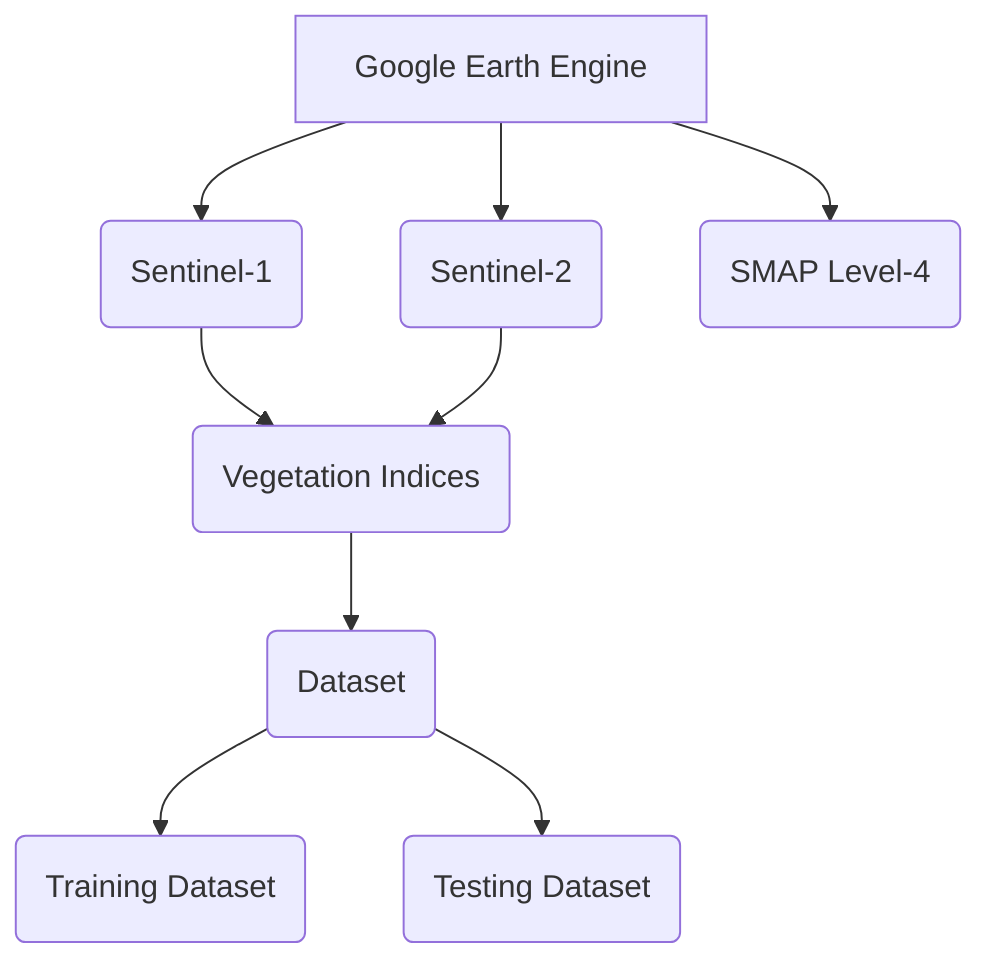

# GEO-AI Challenge for Cropland Mapping by ITU

Timely and accurate crop maps are essential for various applications in agriculture and other relevant research fields. However, the current cropland maps do not align with FAOSATA's definition of crops and arable lands. Furthermore, updating these maps to monitor changes over time poses significant challenges.

The goal of this challenge was to develop accurate and cost-effective classification models to improve the accuracy and robustness of land cover classification with satellite images.

## Software & Hardware Requirements
Google Colab was used for preprocessing, training, and inferencing. 

## Workflow Solution

## Get Started
You can the solution in work fIn the notebooks folder

|Notebook|Running time|
|-----------|--------|
|Notebook 1 | 5 minutes|
|Notebook 2 | 3.5 houres|
